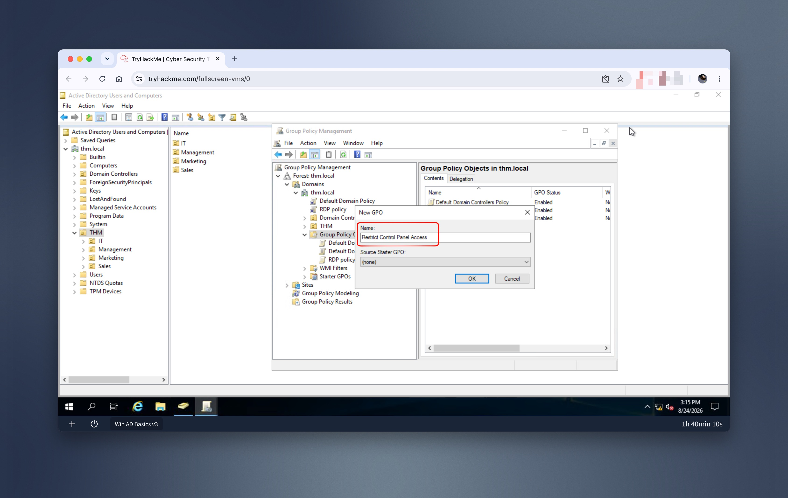
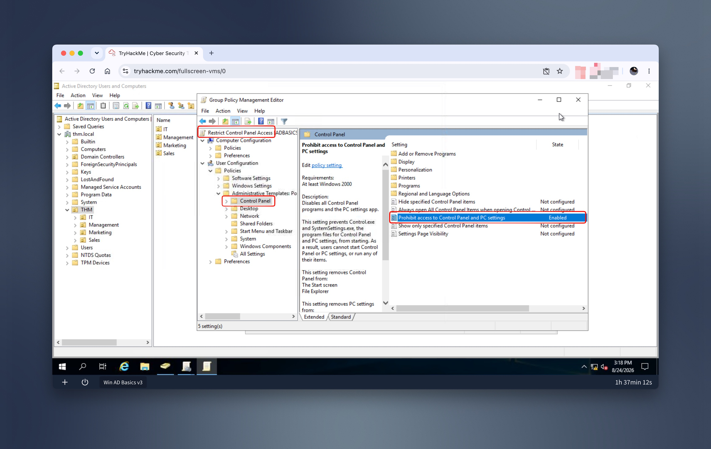
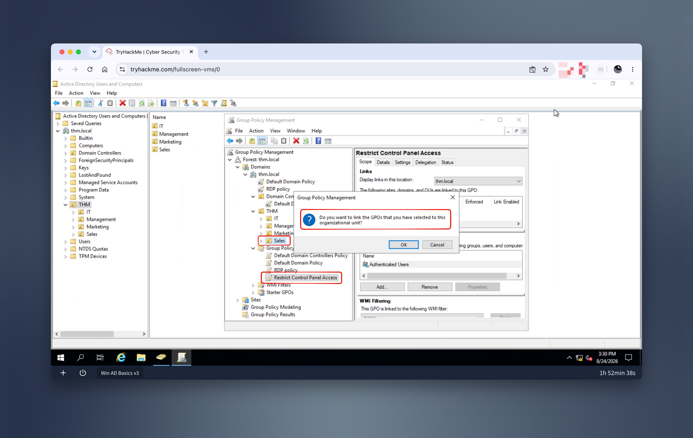
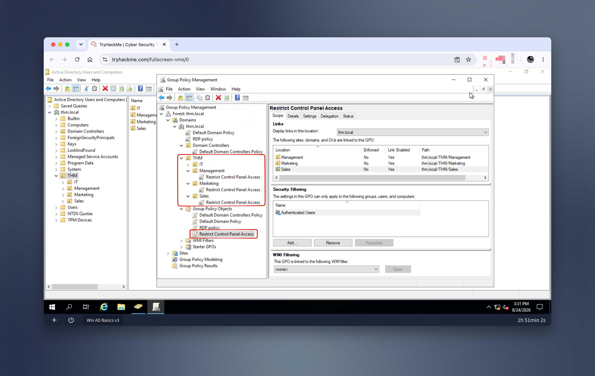
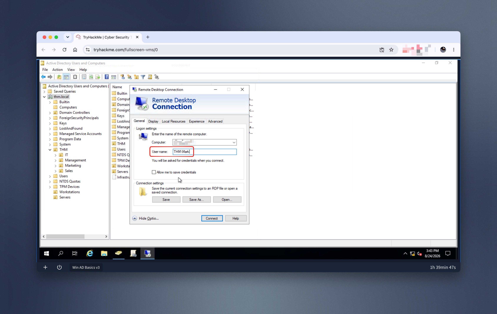
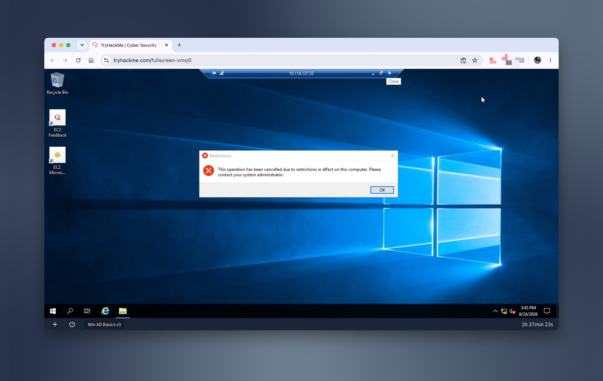
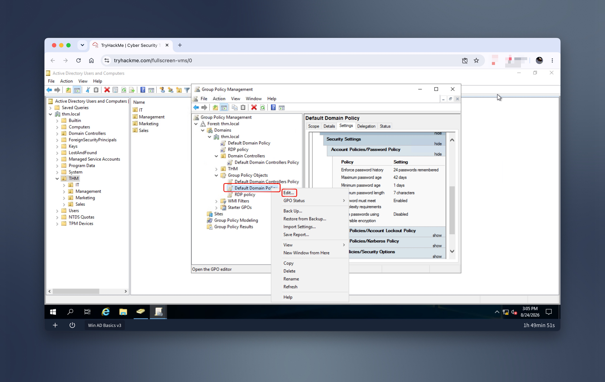
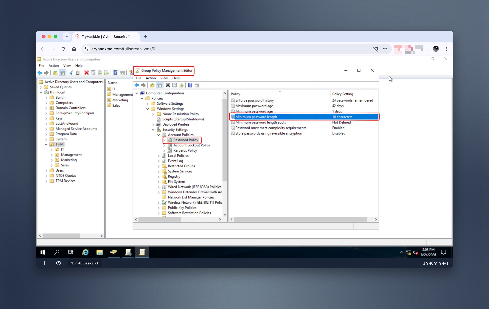
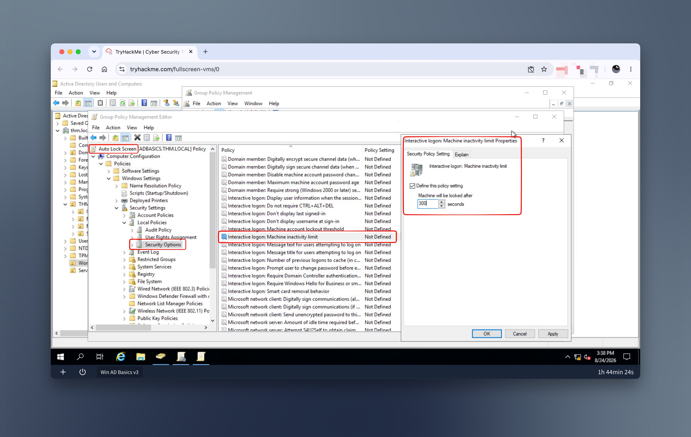
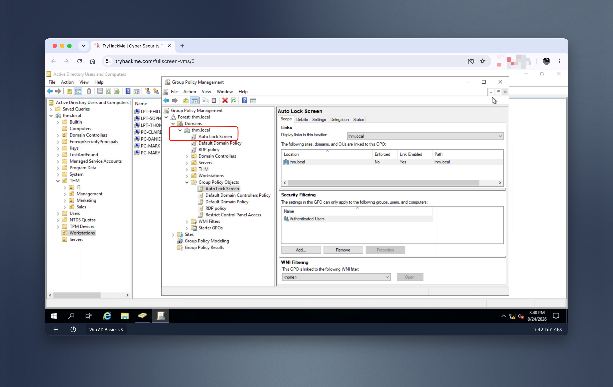

# Lab 01: Active Directory – Enforcing Controls
_Configuring Active Directory Group Policy Objects (GPOs) to enforce least-privilege and defense-in-depth security controls._

This exercise is part of the "Active Directory Basics" room on TryHackMe.

**Tools:** Active Directory · Group Policy Management

---
## Business context
As the company onboards new employees across different departments, it is important to ensure that there are configured technical controls in place that follow least privilege and defense-in-depth principles – to strengthen the company’s security posture and reduce the risk of security incidents.

To practice this skill, I completed the “Active Directory Basics” room on TryHackMe, where I wore the hat of the new IT Administrator at a fictional company and practiced how to configure users, groups, and machines as well as how to create and configure group policies in Active Directory.

---
## Selected scenarios
1. Blocking non-IT users from accessing the Control Panel
2. Enforcing a stronger password requirement
3. Automatically locking inactive stations

---
## Business risks
1. Scenario 1 helps enforce least privilege: giving users the access they need, and not beyond that. For example, if a non-IT user has access to the Control Panel, they can accidentally misconfigure it, which can result in sabotaging their own workstation or disabling security controls.  
2. Scenarios 2 and 3 help enforce defense-in-depth: ensuring that users’ actions strengthen the company’s security posture instead of weakening it. For example, if a user has a weak password (like something from a rockyou base), their account becomes easier to compromise. Same with unlocked, idle sessions – users may step away from their workstations or leave remote administrative sessions active without locking or terminating them, potentially allowing unauthorized individuals to use an already authenticated session.

---
## What I did
### Scenario 1: Blocking non-IT users from accessing the Control Panel
The goal is to restrict access to the Control Panel across all machines to only the users that are part of the IT department. Users of other departments shouldn't be able to change the system's preferences.

My actions:
- Create a new GPO called Restrict Control Panel Access
- Configure it: User Configuration → Administrative Templates → Control Panel → Prohibit access to Control Panel and PC Settings → Enabled

Once the GPO was configured, I linked it to all of the OUs corresponding to users who shouldn't have access to the Control Panel of their PCs. In this case, I linked the Marketing, Management and Sales OUs by dragging the GPO to each of them.

To verify that the restriction has worked, I logged in via RDP as Mark from Marketing and tried to open Control Panel.

### Scenario 2: Enforcing a stronger password requirement
Default Domain Policy applies to the whole domain, and any change to it would affect all computers. I learned to change the minimum password length policy to require users to have at least 10 characters in their passwords (the number comes from the THM lab).

My actions:
- Default Domain Policy → Edit → Computer Configuration → Policies → Windows Setting → Security Settings → Account Policies → Password Policy

### Scenario 3: Automatically locking workstations and server sessions after 5 minutes of inactivity
I set the inactivity limit to 5 minutes so that any interactive session — on a workstation or a server — locks automatically if left idle (the number comes from the THM lab).

After closing the GPO editor, I linked the GPO to the root domain by dragging the GPO to it, as I wanted the GPO to affect all of our computers.

---
## Learnings
- OUs aren't just folders for organizing users – they're what let me scope security controls precisely, instead of applying everything domain-wide.
- I learned that not every control should be linked the same way: I linked the Control Panel restriction to specific OUs (Marketing, Management, Sales), but linked the password policy and auto-lock GPOs to the root domain, since those needed to apply to everyone.
- Configuring GPOs reinforced the notion that IAM is not only about managing identities and access rights, but also about proactively enforcing security policies through technical controls.
