# Lab 02: Active Directory – Delegating Privileges
_Delegating a scoped privilege to the head of IT Support to reset passwords of the users within Sales, Marketing, and Management organizational units of the fictional company._

This exercise is part of the "Active Directory Basics" room on TryHackMe.

**Tools**: Active Directory · Delegation of Control Wizard · PowerShell

---
## Business context
Delegating granular privileges is a way to ensure that a role doesn't have more permissions than it requires. In this example, enabling the Head of IT Support, Phillip, to reset other low-privilege users' passwords in the company ensures that he can perform this task only, and nothing more.

---
## Business risks
If we were to give Phillip Domain Administrator rights, he would be able to perform far more tasks on any users within this domain. More importantly, if his account were to get compromised, an intruder would subsequently have all the same privileges of the Domain Administrator, and could do a lot of damage to the company.

---
## What I did
- Delegated the permission to "Reset user passwords and force password change at next logon" over Sales, Marketing, and Management OUs to Phillip, the Head of IT Support, specifically.
- Used PowerShell commands to enforce password reset on Sophie, an employee of the Sales department.
- Ensured that the reset was enforced. 

---
## Proof it works
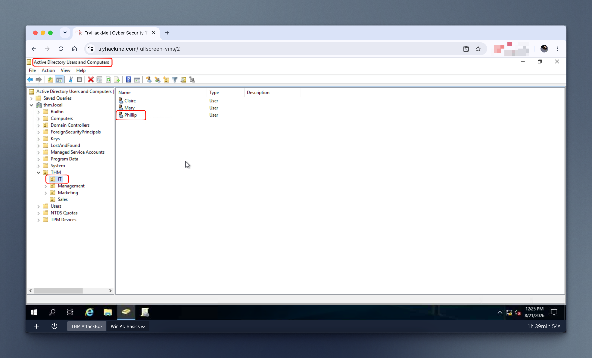

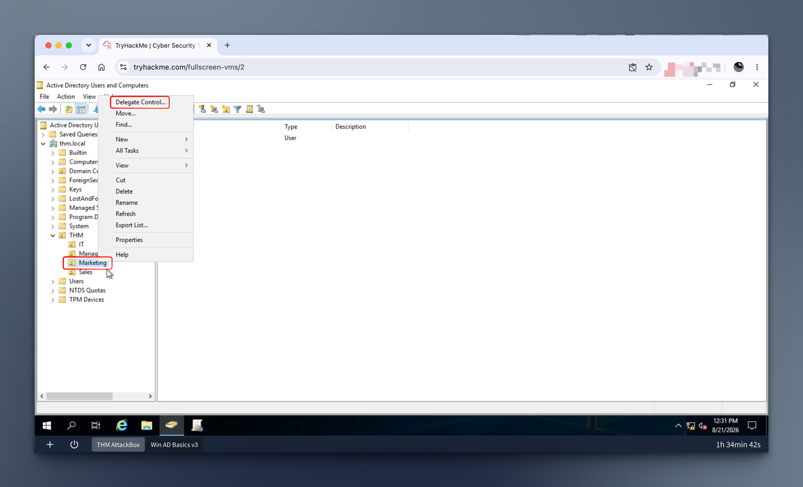

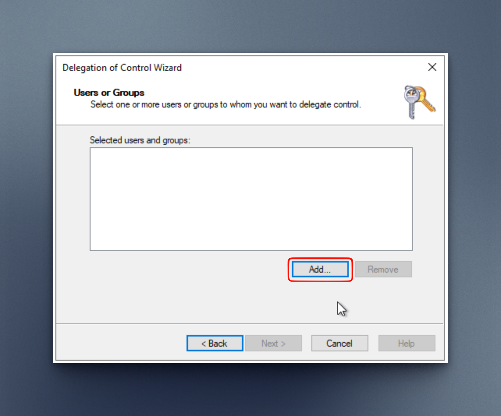

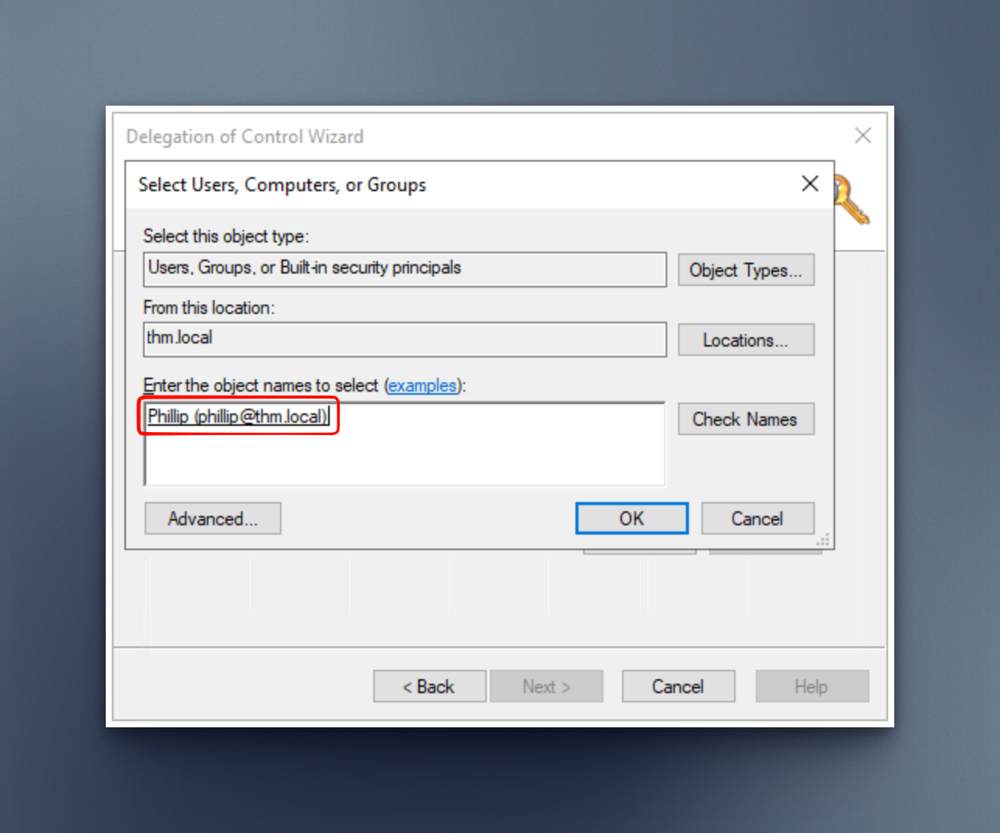

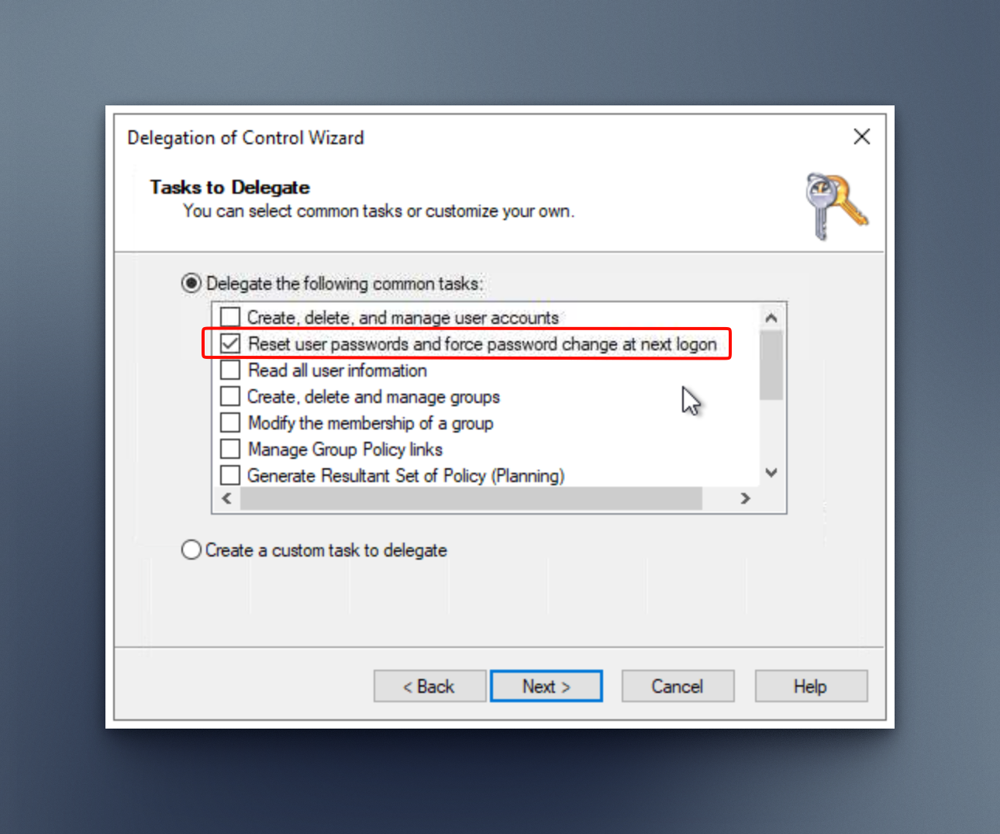

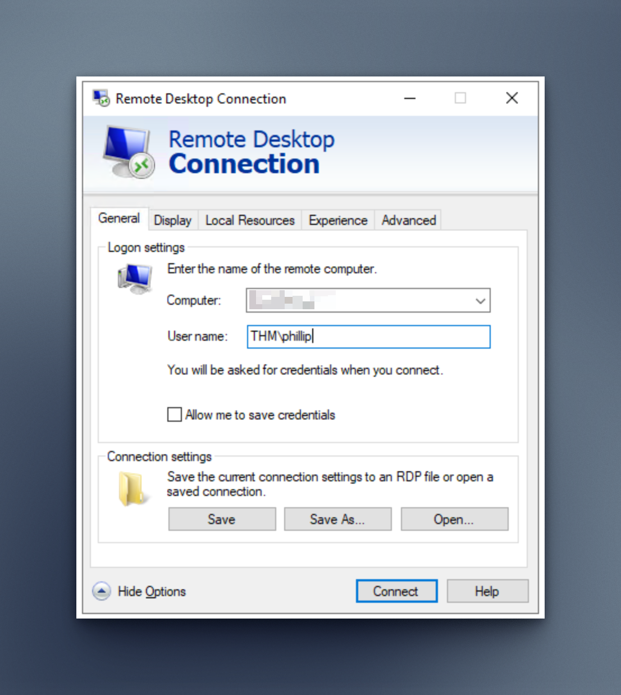

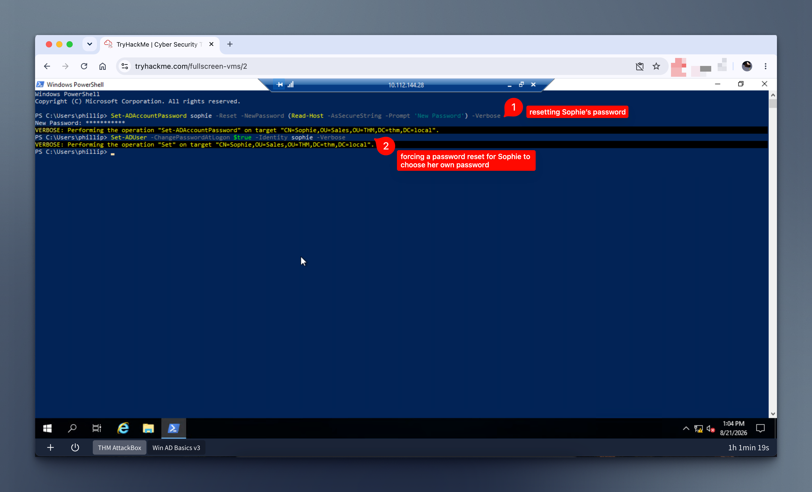

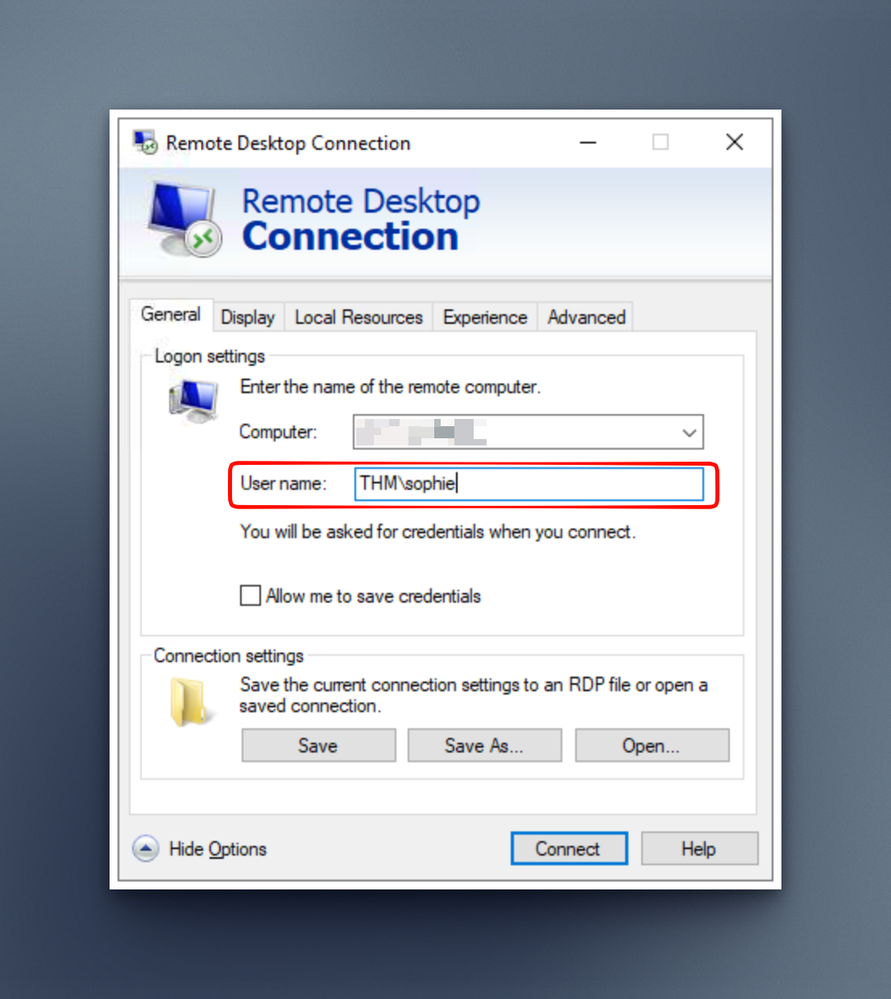

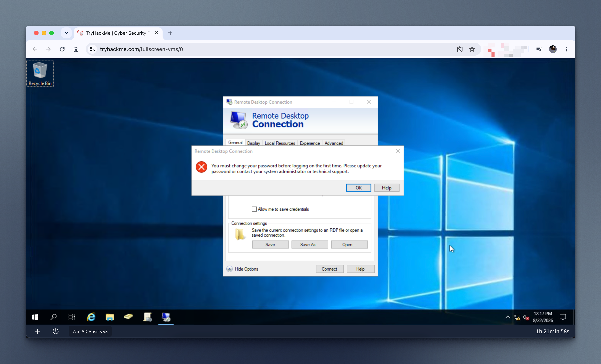

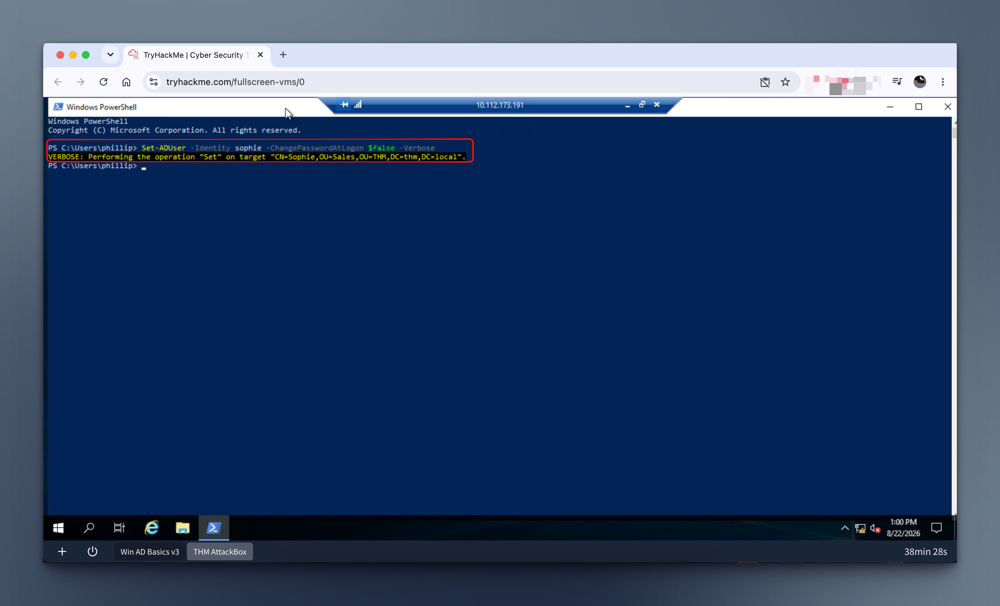

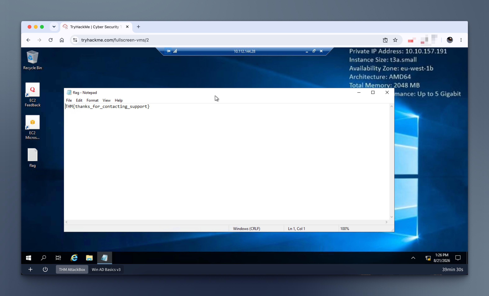

---
## Learnings
- Delegation is granular, and I can scope a specific task (like resetting passwords) to a specific OU, without granting anything else.
- Pairing delegation with ChangePasswordAtLogon reinforces least privilege in practice: the person doing the reset never needs to know the user's actual ongoing password.
- I spent many hours trying to log in as Sophie to show the Windows password change UI flow, but couldn't succeed. This turned out to be because RDP's NLA (Network Level Authentication) requires authentication to complete _before_ Windows can show the interactive password-change screen – so a forced password change blocks the RDP login entirely rather than prompting the UI. I had to disable the "must change password at next logon" flag to log in as Sophie and retrieve the flag.
